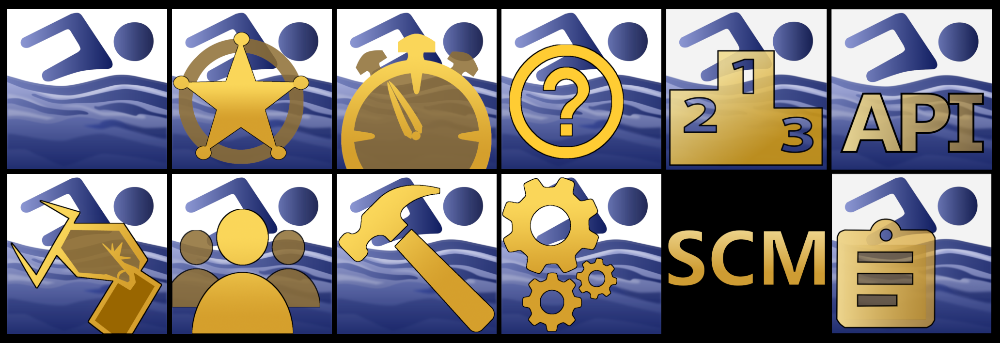
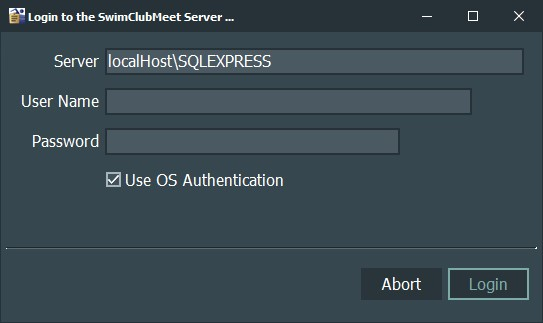
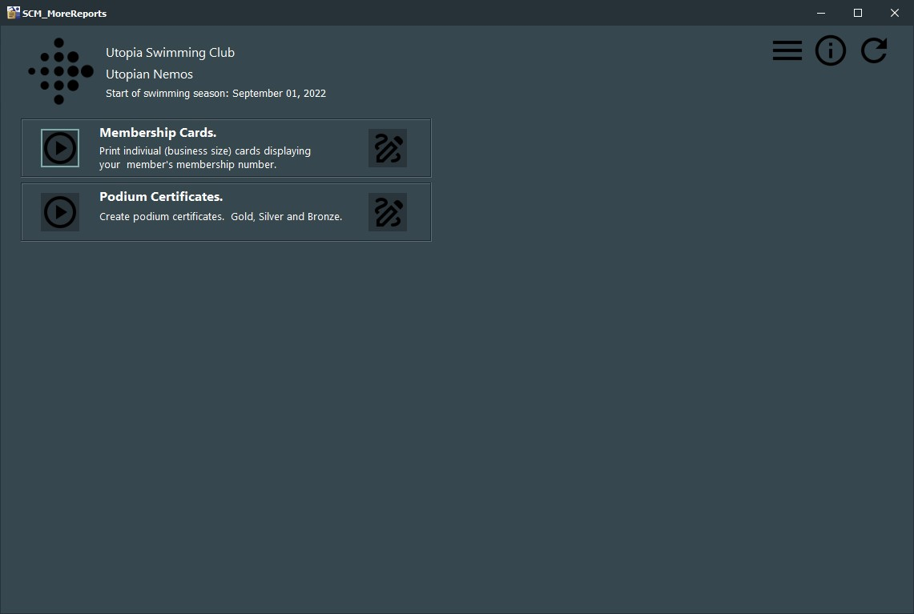
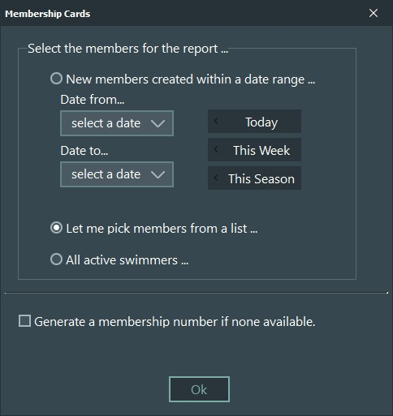
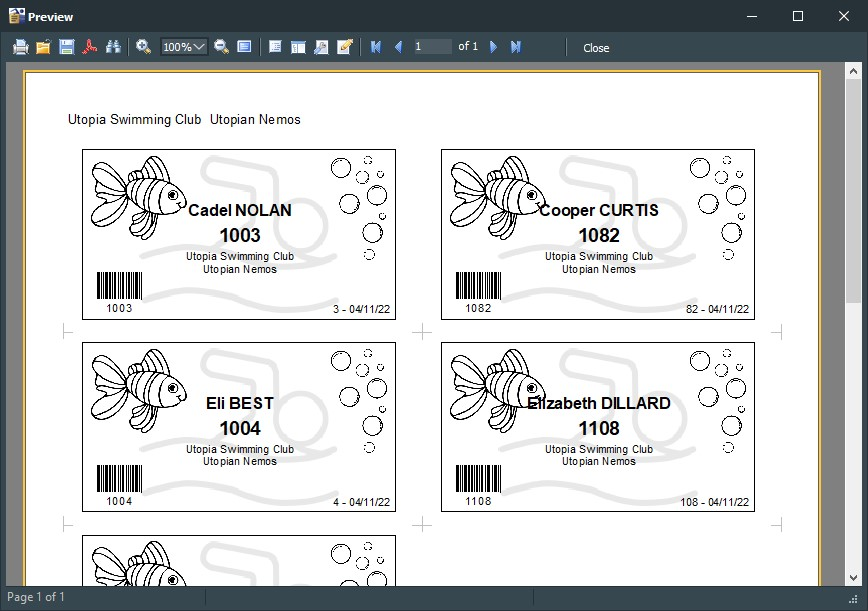

# SCM_MoreReports

 Extra reporting. Create membership cards, podium certificates and more. MoreReports is a support application for SwimClubMeet, a meet manager.

 ---
 About SCM : it manages you members and runs your club-nights.

To learn more about SCM view the [github pages](https://artanemus.github.io/index.html).

If you are interested in following a developer's blog and track my progress then you can find me at [ko-fi](https://ko-fi.com/artanemus).

---

## USING SCM_MoreReports

After install, by default, an icon is placed on the desktop. If you elect to disabled this, type **morereport** in the windows search bar to discover it. Else navigate to the **Artanemus** folder on the start bar. (All SCM applications and utilities are located in this folder.)

### ON START-UP

The application will first ask you to login to the SwimClubMeet SQLEXPRESS database.

Once the application screen has been displayed, you'll note that each report has two buttons. The first button will display the report (a dialogue may appear, asking for input) Once the report is displayed, you have the option to print it or export (PDF, BMP, etc)

The 2nd button lets you customize it. The FastReport designer interface will open. It is full of features. You can find the user documents at [FastReport users manual](https://www.fast-report.com/public_download/docs/FRVCL/online/en/UserManual/en-US/Designer.html).

Have a great club night!

> Use Windows **Apps and Features** to remove the application.

---

